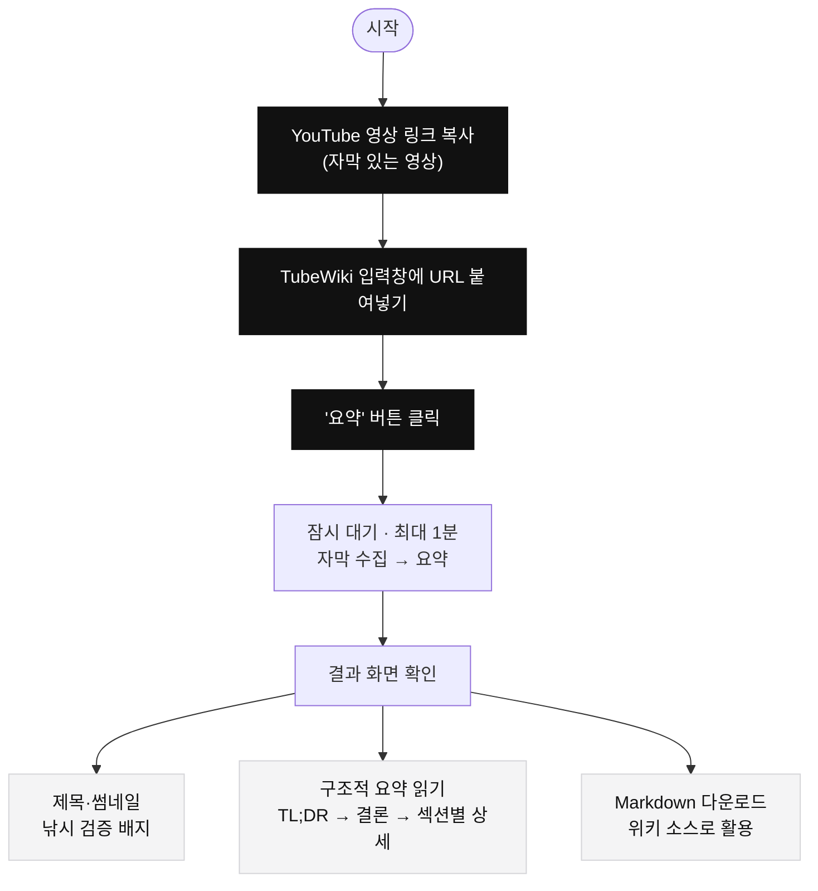
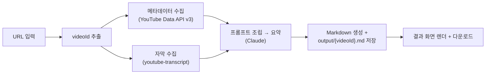

# TubeWiki

**YouTube 링크 하나로 영상 전체를 구조적으로 요약하고, 제목·썸네일이 실제 내용과 맞는지(낚시 여부) 검증하는 웹 도구.**

영상을 끝까지 보지 않고도 전체 맥락을 정확히 파악하고 싶은 사람, 그리고 유튜브 내용을 LLM 위키/지식 베이스의 소스 문서로 축적하고 싶은 사람을 위한 MVP입니다.

---

## ✨ 무엇을 해주나

- **과잉 압축 없는 구조적 요약** — 3줄 요약이 아니라, 전체 흐름을 파악할 수 있는 개요 + 섹션별 상세.
- **제목·썸네일 낚시 검증** — 제목/썸네일이 실제 내용과 얼마나 맞는지 `일치 / 부분일치 / 불일치` + 근거로 판정. (이 도구의 핵심 차별점)
- **정보 밀도 높은 Markdown 생성** — 인용·수치·인물·용어를 보존한 MD를 만들어 다운로드. LLM 위키의 소스로 바로 쓸 수 있음.
- **항상 한국어 출력** — 영상 언어와 무관하게 요약 결과는 한국어.

---

## 🧭 사용자가 하는 일 (핵심 프로세스)

사용자가 실제로 하는 건 딱 **3가지** 뿐입니다 — 링크 붙여넣기 → 요약 버튼 → 결과 확인/다운로드.



### 단계별 설명

| 단계 | 사용자가 하는 것 | 화면에서 일어나는 것 |
|---|---|---|
| 1. 입력 | 유튜브 URL을 입력창에 붙여넣기 | `watch?v=`, `youtu.be/`, `shorts/`, `embed/` 형식 지원 |
| 2. 실행 | **요약** 버튼 클릭 | "자막·메타데이터 수집 → 요약 중…" 안내 (최대 1분) |
| 3. 확인 | 결과 화면 읽기 | 아래 결과물이 렌더링되어 표시 |
| 4. 저장 | **Markdown 다운로드** 버튼 클릭 | `{videoId}.md` 파일로 저장 (서버 `output/`에도 저장됨) |

---

## 📄 결과물로 얻는 것

요약 결과 화면과 다운로드되는 Markdown에는 다음이 담깁니다:

- **낚시 검증 배지** — `일치`(초록) / `부분일치`(주황) / `불일치`(빨강) + 판정 근거
- **TL;DR → 핵심 결론 → 전체 개요 → 섹션별 상세**
- **핵심 포인트 · 인용문 · 등장 인물/용어(엔티티) · 키워드**
- 영상 메타데이터(제목·채널·게시일·조회수·길이 등)

> 원본 Markdown 텍스트는 화면에 그대로 노출하지 않고, 구조화된 요약으로 렌더링합니다. MD는 다운로드/저장용 아티팩트입니다.

---

## ⚙️ 내부 동작 (참고)

버튼을 누른 뒤 서버에서 일어나는 파이프라인입니다. 외부 API 호출과 비밀 키는 **모두 서버에서만** 처리합니다.



자막이 없는 영상은 지원하지 않으며, 명확한 안내 메시지로 종료합니다(에러 3종: URL 오류 400 / 자막 없음 422 / 그 외 500).

---

## 🚀 빠르게 실행하기

> 자세한 실행·종료·트러블슈팅은 **[RUN.md](./RUN.md)** 참고.

**요구사항:** Node.js 18.18+, [YouTube Data API v3](https://console.cloud.google.com/) 키, [Anthropic API](https://console.anthropic.com/) 키(크레딧 필요).

```bash
npm install
```

프로젝트 루트에 `.env.local` 생성 (템플릿: [.env.example](./.env.example)):

```
ANTHROPIC_API_KEY=sk-ant-...     # 필수 (요약)
YOUTUBE_API_KEY=AIza...          # 필수 (메타데이터)
SUMMARY_MODEL=claude-sonnet-5    # 선택 (기본값)
WIKI_OUTPUT_DIR=./output         # 선택 (MD 저장 폴더)
```

실행 (프로덕션 모드 권장):

```bash
npm run build
npm run start     # http://localhost:3000
```

브라우저에서 http://localhost:3000 접속 → YouTube URL 입력 → 요약.

---

## 🔑 환경변수

| 변수 | 필수 | 설명 |
|---|:---:|---|
| `ANTHROPIC_API_KEY` | ✅ | Claude 요약 호출용 (서버 전용) |
| `YOUTUBE_API_KEY` | ✅ | YouTube Data API v3 — 제목·채널·썸네일·게시일·조회수·설명·태그·길이 |
| `SUMMARY_MODEL` | | 요약 모델 (기본 `claude-sonnet-5`) |
| `WIKI_OUTPUT_DIR` | | 생성된 MD 저장 폴더 (기본 `./output`) |

`.env.local`은 서버에서만 읽히며 클라이언트에 노출되지 않습니다. **실제 키는 절대 커밋하지 마세요.**

---

## 🛠 기술 스택

- **Next.js 15** (App Router) · **TypeScript** (strict)
- **Tailwind CSS**
- **Anthropic SDK** (`@anthropic-ai/sdk`) — 요약 LLM
- **youtube-transcript** — 자막 수집 / **YouTube Data API v3** — 메타데이터
- **Vitest** — 테스트

## 📁 프로젝트 구조

```
src/
├─ app/
│  ├─ api/summarize/route.ts   # 오케스트레이션 (서버)
│  └─ page.tsx                 # 입력 → 로딩 → 결과 화면
├─ components/                 # ResultView, VerificationBadge
├─ services/                   # youtube.ts, claude.ts (외부 API 래퍼)
├─ lib/                        # youtube-url, prompt, markdown (순수 함수 + 테스트)
└─ types/index.ts              # 도메인 타입 계약
```

## 📜 명령어

```bash
npm run dev      # 개발 서버 (핫리로드)
npm run build    # 프로덕션 빌드
npm run start    # 프로덕션 서버
npm run lint     # ESLint
npm run test     # 테스트 (vitest)
```
